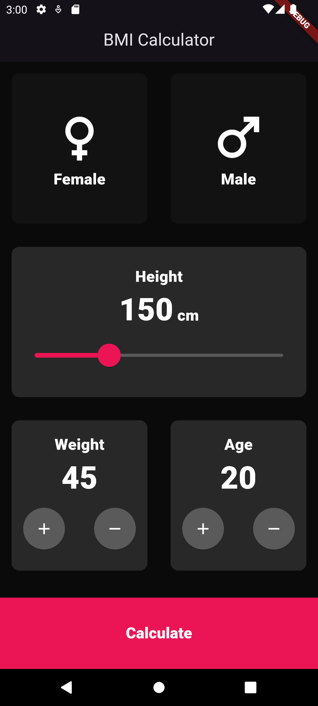
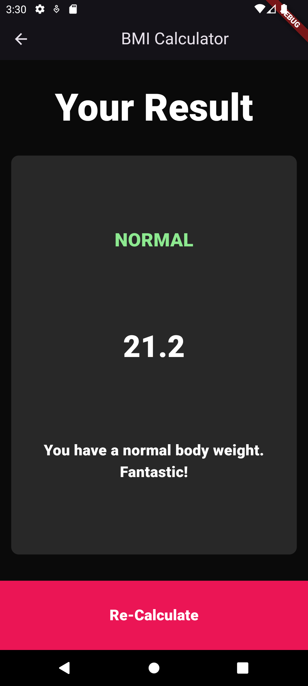

# BMI Calculator App

A simple Body Mass Index (BMI) Calculator built using Flutter. This app allows users to calculate their BMI by selecting their gender, adjusting their height, weight, and age, and then clicking the "Calculate" button. The design is inspired by a modern, dark theme with vibrant accent colors.

## Features

- **Gender Selection**: Users can select their gender (Male or Female).
- **Height Adjustment**: A slider allows users to adjust their height in centimeters.
- **Weight & Age Adjustment**: Buttons allow users to increment or decrement their weight (in kg) and age (in years).
- **BMI Calculation**: Upon clicking the "Calculate" button, the app computes the BMI based on the input values.

## Screenshots




## Installation

To run this project, ensure you have the Flutter SDK installed on your machine. If you don't have it installed, follow the instructions [here](https://flutter.dev/docs/get-started/install).

1. Clone the repository:
   ```bash
   git clone https://github.com/yourusername/bmi_calculator.git
   ```
2. Navigate to the project directory:
   ```bash
   cd bmi_calculator
   ```
3. Install the dependencies:
   ```bash
   flutter pub get
   ```
4. Run the app on an emulator or a physical device:
   ```bash
   flutter run
   ```

## Usage

- Select your gender by tapping either the **Female** or **Male** option.
- Adjust your height using the slider.
- Modify your weight and age using the "+" and "-" buttons.
- Click on the **Calculate** button to view your BMI.
